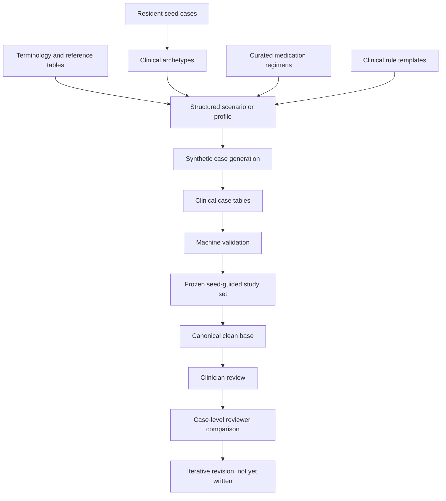
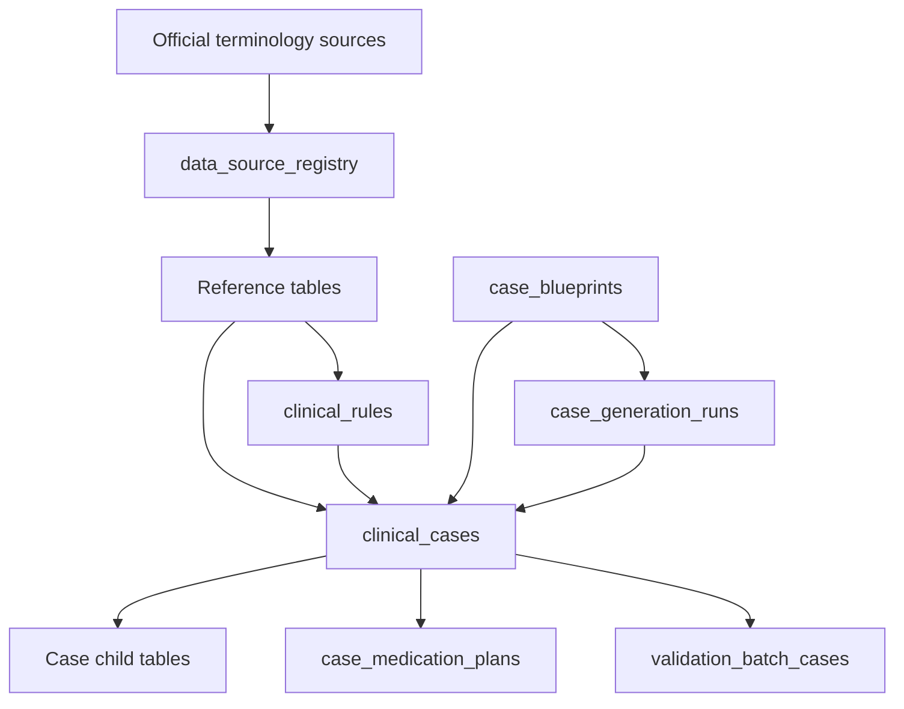
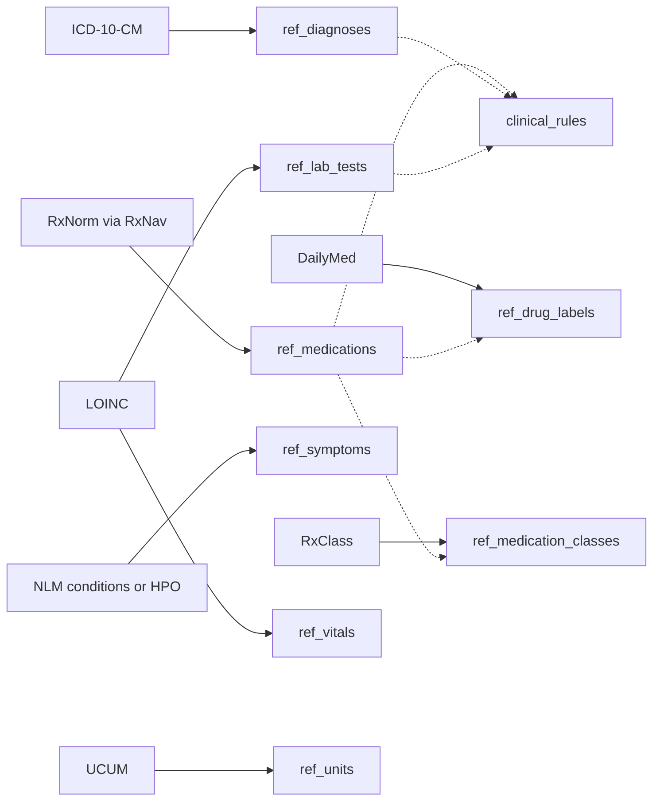

# CliniProof

## Project overview

CliniProof is a structured synthetic clinical-case generation and validation framework. It exists so that research on medication reconciliation, transition-of-care reasoning, discharge medication decision-making, and clinical reasoning can use hospitalizations whose contents are known, source-backed, and separable from any later experimental manipulation. A later stage of that research may evaluate how a resident responds to an erroneous recommendation or to an AI-generated recommendation. That later stage is not the work represented in this repository today.

The scientific question supported by the current materials is whether a synthetic hospitalization is a credible and sufficiently informative base case. A resident, in the intended study, reads one hospitalization and independently determines the discharge medication plan. Reasoning and confidence may be collected. The response is then compared with a clinician-reviewed reference. Only after the base case has been accepted would an error-bearing chart or an AI-generated recommendation be introduced, and only then would the resident’s response to that intervention be evaluated.

The sequence is therefore:

```text
clean validated clinical case
        ↓
resident independently determines the discharge medication plan
        ↓
resident reasoning and confidence may be collected
        ↓
response compared with a clinician-reviewed reference
        ↓
only later, where relevant:
error-bearing or AI-generated recommendation introduced
        ↓
resident response to that intervention evaluated
```

The methodological principle is that the base case is validated first. Clinical-case validation and later error evaluation are separate stages. If they are mixed, a resident’s difficulty with an injected discrepancy cannot be distinguished from a problem in the hospitalization itself.

No case in the current tree has completed that validation. Automated checks can show that a chart is internally consistent with the project’s rules. They do not establish clinical acceptance.

## Current source of truth

The working tree keeps one original seed-guided study set, one canonical clean base, two completed clinician reviews, one normalized comparison, and one unchanged coding instrument. The second revision of the overlapping cases has not been written.

| Artifact | Purpose | Current source |
| --- | --- | --- |
| Original frozen seed-guided set | Historical first-round study source, batch `CLINIPROOF_SEEDCASES_V3`, VAL-801–VAL-824 | [data/case_sets/seed_guided/](data/case_sets/seed_guided/) |
| Canonical clean base | Starting point for the current clinical revision: 24 clean cases and 48 resident/evaluator JSON files | [data/case_sets/seed_guided/CLEAN_BASE/](data/case_sets/seed_guided/CLEAN_BASE/) |
| Reviewer 1 completed review | Original clinician feedback, preserved byte for byte | [docs/clinical_feedback/reviewer_1/KO_Casebook_Validation.docx](docs/clinical_feedback/reviewer_1/KO_Casebook_Validation.docx) |
| Reviewer 2 completed review | Original clinician feedback, preserved byte for byte | [docs/clinical_feedback/reviewer_2/CliniProof_SeedGuided_Validation_Casebook_final_alex.docx](docs/clinical_feedback/reviewer_2/CliniProof_SeedGuided_Validation_Casebook_final_alex.docx) |
| Reviewer comparison | Normalized case-level comparison | [docs/clinical_feedback/reviewer_comparison.md](docs/clinical_feedback/reviewer_comparison.md) |
| Validation instrument | Unchanged clinical coding form | [docs/validation/CliniProof_Clinical_Validation_Template.docx](docs/validation/CliniProof_Clinical_Validation_Template.docx) |
| Methodology | Current iterative clinician-review method | [docs/methodology.md](docs/methodology.md) |
| Revised overlap cases | VAL-801, VAL-805, VAL-809, VAL-813, ready for the next clinician review and not clinically validated | [data/case_sets/seed_guided/REVISED/overlap_4/](data/case_sets/seed_guided/REVISED/overlap_4/) |

The original freeze lives in [data/case_sets/seed_guided/](data/case_sets/seed_guided/) excluding [CLEAN_BASE/](data/case_sets/seed_guided/CLEAN_BASE/). `CLEAN_BASE` is stored inside that directory so the clean charts stay next to the freeze they were recovered from. It is a separate artifact. The freeze still contains the historical planted-error variants. The clean base does not.

## Clinician review source documents

Two completed clinician-review documents were received independently. Each reviewer used the seed-guided validation casebook. The completed forms are preserved byte for byte as source material. This README does not rewrite their comments, and it does not fill in ratings that the forms left blank.

Reviewer 1 completed casebook: [KO_Casebook_Validation.docx](docs/clinical_feedback/reviewer_1/KO_Casebook_Validation.docx).

Reviewer 2 completed casebook: [CliniProof_SeedGuided_Validation_Casebook_final_alex.docx](docs/clinical_feedback/reviewer_2/CliniProof_SeedGuided_Validation_Casebook_final_alex.docx).

The blank instrument those reviews used, with every checkbox unchecked, is the [clinical validation template](docs/validation/CliniProof_Clinical_Validation_Template.docx). Field definitions are in [CODEBOOK.md](docs/validation/CODEBOOK.md). The normalized extraction is a reading aid. It does not replace either Word file.

The validation casebooks are fillable Microsoft Word documents. Click the checkboxes to select ratings and type comments directly into the provided fields. Select one response per rating item. Open the file in desktop Microsoft Word.

## Review coverage

Both reviewers provided clinical feedback. The comparison does not assign them different scientific roles. Coverage is incomplete, and the incompleteness is part of the record.

| Reviewer | Cases with substantive feedback | Cases without substantive feedback |
| --- | --- | --- |
| Reviewer 1 | 6 of 24: VAL-801, VAL-802, VAL-803, VAL-805, VAL-809, VAL-813 | 18 cases have no substantive completed feedback |
| Reviewer 2 | 4 of 24: VAL-801, VAL-805, VAL-809, VAL-813 | 20 cases have no selected ratings or comments |

On Reviewer 2’s four reviewed cases, C2 through C5 and the overall recommendation were blank. Those fields were not inferred. VAL-803, reviewed only by Reviewer 1, has a completed C1. The later ratings and the overall recommendation on that case are blank and were left blank.

“No substantive completed feedback was recorded” means the form has no selected rating and no comment for that case. It is a property of the returned document.

## Case-level comparison of the two reviews

The two reviews were compared with the same coding structure. The analysis is case-based. For each reviewed case the comparison preserves the original rating, preserves the free-text comment, identifies areas of agreement, identifies complementary comments, and identifies reviewer-specific concerns. It does not force a consensus where the two forms disagree or where one form is silent.

The full normalized table is [reviewer_comparison.md](docs/clinical_feedback/reviewer_comparison.md), with one row per case in [reviewer_comparison.csv](docs/clinical_feedback/reviewer_comparison.csv). Original wording remains in the two Word files linked above.

Four cases had substantive feedback from both reviewers:

- VAL-801
- VAL-805
- VAL-809
- VAL-813

Those four form the next iterative revision set because both clinicians wrote on them. They are marked `SECOND_REVISION_CANDIDATE` in the comparison file. They have not been revised.

Two further cases have substantive feedback from Reviewer 1 only:

- VAL-802
- VAL-803

They stay in the comparison. They are not treated as consensus cases, and they are not the cases selected for this revision round.

The overlapping concerns, stated at the level of the comparison and without replacing the original sentences, are these.

VAL-801. Both reviewers found the delirium story clinically insufficient. Reviewer 1 also found the cause unshown and the ibuprofen stop unexplained, and recommended revise. Reviewer 2 wrote that delirium has to be a change from baseline and that a precipitant should be interpretable. Reviewer 2’s later fields are blank.

VAL-805. Both reviewers found the heart-failure hospitalization clinically incomplete. Reviewer 1 described an inpatient diuretic course that matches the home dose, a discharge weight that is not at dry weight, and heart-failure therapy that is not set up as a decision, and recommended revise. Reviewer 2 passed C1 and wrote that the chart does not investigate why heart failure decompensated. Later fields are blank.

VAL-809. Both reviewers found the endocarditis case too thin for the reasoning it asks. Reviewer 1 asked for fever and a predisposition, and questioned continuing lisinopril alongside a creatinine rise, and recommended revise. Reviewer 2 asked for source evaluation, laboratory changes, imaging, and consideration of surgery, and failed C1. Later fields are blank.

VAL-813. Both reviewers found the cytomegalovirus presentation clinically incoherent. Reviewer 1 noted that valganciclovir was already a home medicine, that the transplant regimen is too thin, and that a potassium change is unexplained, and recommended exclude. Reviewer 2 wrote that the patient should not present already labeled with CMV colitis, and that volume loss should be considered in the kidney function and potassium. C1 is Fail. Later fields are blank.

| Case | Reviewer 1 | Reviewer 2 | Current status |
| --- | --- | --- | --- |
| VAL-801 | Reviewed | Reviewed | Second revision |
| VAL-802 | Reviewed | No substantive feedback | Retained as Reviewer-1-only |
| VAL-803 | Reviewed | No substantive feedback | Retained as Reviewer-1-only |
| VAL-805 | Reviewed | Reviewed | Second revision |
| VAL-809 | Reviewed | Reviewed | Second revision |
| VAL-813 | Reviewed | Reviewed | Second revision |

Eighteen other cases had no substantive Reviewer 1 feedback. Twenty cases in total had no substantive Reviewer 2 feedback. Those eighteen are omitted from the table above because both forms are silent on them; they remain in the comparison CSV.

## Structured iterative clinician review

The current method is a structured iterative clinician review. It can also be called Delphi-informed iterative clinician review, because independent clinicians respond to a shared instrument, their responses are compared, and a later round is expected to use that same instrument after targeted revision.

It is not a classical Delphi study. A classical Delphi study would convene a larger panel and would declare consensus with a formal, predefined statistical threshold. The current process has two clinician reviewers, incomplete coverage of the 24 cases, and no such threshold. Agreement is described case by case. Silence is not converted into agreement.

What the process does include is the following. Independent clinician responses were collected. Responses were structured with a common codebook. Responses were compared. Overlapping cases and concerns were identified, and reviewer-specific concerns were retained alongside the shared ones. The cases read by both reviewers were selected for iterative revision. The same codebook will be used again in the next round, so a later rating can be compared with the rating already recorded.

```text
clean case
        ↓
Reviewer 1 assessment
        +
Reviewer 2 assessment
        ↓
structured case-level comparison
        ↓
shared concerns and reviewer-specific concerns retained
        ↓
cases reviewed by both selected for iterative revision
        ↓
clinical revision
        ↓
same validation codebook
        ↓
next clinician review
```

The manuscript form of this method is [docs/methodology.md](docs/methodology.md).

## Why clean cases are the unit of validation

The clinical case itself has to be credible and sufficiently informative before any later assessment manipulation can be interpreted. If the base scenario is internally inconsistent, or if a clinician cannot tell what happened during the hospitalization, then performance on a later injected medication error is ambiguous. The error and the broken case are confounded.

Base-case validation therefore precedes error evaluation and recommendation evaluation. The charts under review are clean hospitalizations. The resident is not shown a completed discharge list and is not asked to find a planted discrepancy. The research team holds a separate reference plan, on the evaluator file, for comparison after clinicians have accepted it.

Historical error-bearing variants remain part of provenance. They are the original frozen files in [data/case_sets/seed_guided/](data/case_sets/seed_guided/), and they can be recovered from Git history. They are not the starting point for the current revision. The current revision begins from [data/case_sets/seed_guided/CLEAN_BASE/](data/case_sets/seed_guided/CLEAN_BASE/).

Each file in that directory is a byte-identical copy of the recovered pre-injection chart. There are 24 resident JSON files and 24 evaluator JSON files. The resident file carries the chart. The evaluator file carries the same chart plus `reference_discharge_plan`. SHA-256 values are in [docs/source_integrity.md](docs/source_integrity.md). The clean base is preserved so that a revision can be compared with a known chart. It should be read and, when the revision is written, copied forward. It should not be regenerated in place in order to “improve” it.

## How the original seed-guided set was generated

`CLINIPROOF_SEEDCASES_V3` contains 24 study slots, VAL-801 through VAL-824. The design began with six resident-provided clinical cases in [data/seed_cases/resident_authored/](data/seed_cases/resident_authored/). Those documents were not copied into the study dataset. They were abstracted into clinical and discharge archetypes in [data/seed_cases/blueprints/archetypes.json](data/seed_cases/blueprints/archetypes.json). The resident examples are design inputs. They are not prevalence data, and the study cases are not copies of the resident cases. Six documents cannot estimate how often a problem, a drug, or an error occurs on a medicine service.

The six workflow families still defined by those blueprints are:

| Archetype | Clinical workflow | Resident source document | Study slots |
| --- | --- | --- | --- |
| `MEDREC_UNCERTAIN_HISTORY` | Medication-history uncertainty | `Bad_Med_Rec_Case.docx` | VAL-801–VAL-804 |
| `HF_DECOMPENSATION` | Acute heart-failure decompensation | `Heart_Failure_Case.docx` | VAL-805–VAL-808 |
| `OPAT_ENDOCARDITIS` | Infective endocarditis and outpatient parenteral antimicrobial transition | `OPAT_Case.docx` | VAL-809–VAL-812 |
| `TRANSPLANT_CMV` | Kidney transplant and cytomegalovirus treatment | `Post_transplant_case.docx` | VAL-813–VAL-816 |
| `POSTOP_ANTICOAGULATION` | Hip fracture with interruption and resumption of anticoagulation | `Post-Op_Case.docx` | VAL-817–VAL-820 |
| `GI_BLEED_ACUTE_CHANGE` | Gastrointestinal bleeding with anticoagulation hold and restart | `Sepsis_AMA_Case.docx` | VAL-821–VAL-824 |

Four synthetic profiles were generated from each archetype, which yields 24 cases. A profile is one synthetic variant of an archetype. Profiles differ before any historical error injection, in symptoms, hospital course, which medication is held or started, and what follow-up is arranged. Four profiles are a study-design choice so that each family can carry more than one assignment. Four is not a prevalence weight. The profile codes and the details that were intentionally varied are documented in [data/seed_cases/README.md](data/seed_cases/README.md).

The gastrointestinal-bleeding source includes a later febrile, hypotensive course. That overlay is documented with the seed and is omitted from the generated charts. The study variants are discharge-ready after bleeding has settled, because an obviously unstable patient would make a discharge medication decision uninterpretable.

Generation does not parse the DOCX files at freeze time. The blueprint version is `seed-archetypes-v1`, and the generation strategy is `resident_seed_guided`. Changing a source document without changing the blueprint does not change a generated case.

The path from a resident example to a frozen slot is:

```text
resident source case
        ↓
clinical abstraction / archetype
        ↓
structured scenario and profile
        ↓
terminology-backed concepts
        ↓
synthetic patient-specific values
        ↓
structured synthetic hospitalization
        ↓
machine validation
        ↓
frozen study slot
```

What is synthesized for every study patient is the age, sex, weight, vital signs, laboratory numbers, narrative sentences, and the specific orders taken from the curated regimen. What is not copied is the patient’s name, neighborhood, family members, the source laboratory series, brand combinations peculiar to the example, organism names and valve-surgery years from the endocarditis example, a tacrolimus goal copied as though it were a hard rule, opioid tapers, and the later sepsis overlay in the gastrointestinal-bleeding source. Resident-facing JSON does not include the DOCX filename, the seed-author identity, or the investigator answer key.

## First-round study construction

The first-round pipeline has two stages that need to stay distinct. Stage A builds the clean underlying synthetic case. Stage B, used historically, plants one assessment manipulation on top of that clean case and then freezes the result under a VAL identifier.

```text
official terminology and reference data
        ↓
scenario / archetype
        ↓
structured clean case
        ↓
source-backed rules and internal checks
        ↓
clean case
        ↓
historical assessment manipulation, where assigned
        ↓
frozen VAL identifier
        ↓
clinician review of the materials sent to reviewers
```

The batch plan is [data/case_sets/seed_guided/batch_plan.json](data/case_sets/seed_guided/batch_plan.json). Its master seed is `20260926`. The plan sets `inject_error` to false for four assignments and to true for the other twenty. The four historical clean controls are VAL-801, VAL-805, VAL-809, and VAL-813. The other twenty frozen charts are error-bearing variants. That 20-and-4 split is historical provenance of the original freeze. The same four identifiers later received substantive comments from both reviewers. The reason they are the second-revision set is that dual review, recorded in the comparison file, not a decision to revise only the historical controls.

The current iterative revision does not start from the error-bearing version. It starts from [CLEAN_BASE](data/case_sets/seed_guided/CLEAN_BASE/). Those files are the pre-injection charts for all 24 slots, including the twenty that were later altered in the freeze. The original freeze also shows reference leakage on the four control exports; the clean-base resident files keep the reference plan off the resident chart.

The optional injection step remains in the generator as an experimental flag, `--inject-error`, because the generation service still imports it. The default generation path builds a clean case. Injection is not the current review workflow.

## Data and knowledge sources

Generation draws on several files that do different jobs. Terminology identity, a curated dose, a clinical rule, and a resident’s example are not interchangeable.

### Resident-provided seed cases

Location: [data/seed_cases/](data/seed_cases/).

The six DOCX files under [resident_authored/](data/seed_cases/resident_authored/) are the clinical design input. The blueprints under [blueprints/](data/seed_cases/blueprints/) are the abstraction actually consumed by seed-guided generation. The DOCX files do not supply RxNorm, LOINC, ICD-10-CM, or UCUM identifiers.

### Scenario definitions

[data/bootstrap/scenarios.json](data/bootstrap/scenarios.json) defines the scenario grid used by `generate-synthetic-cases`. A scenario contributes a specialty, a care context, an age band, diagnosis and symptom queries, medication queries, laboratory queries, and one or more clinical profiles. The five scenario codes in that file are `HF_INPATIENT`, `AF_ANTICOAGULATION`, `HTN_INPATIENT`, `T2DM_INPATIENT`, and `CAP_INPATIENT`.

Those five codes are not the six seed archetypes. The seed-guided batch resolves its scenario field against [archetypes.json](data/seed_cases/blueprints/archetypes.json). A new case generated from `scenarios.json` is a development case. It is not a replacement for VAL-801–VAL-824.

### Medication regimens

[data/bootstrap/medication_regimens.json](data/bootstrap/medication_regimens.json) holds 24 curated regimens. Each entry binds a human-readable drug query to an administered dose, route, frequency, and temporal role, and it stores a citation. Product strength in RxNorm is not treated as the administered dose. “Once daily” is not a default frequency invented when a citation is missing. Profile restrictions on an entry, such as the apixaban dose criteria, are constraints the generator keeps the synthetic patient inside.

### Rule templates

[data/bootstrap/rule_templates.json](data/bootstrap/rule_templates.json) holds three clinical conditionals: `NO_DUAL_ORAL_ANTICOAGULANT` (hard), `WARFARIN_INR_MONITORING` (hard), and `FUROSEMIDE_HF_INDICATION` (soft). A rule is a deterministic check. It prohibits a stated coadministration, requires a stated laboratory observation, or records a soft allow-relationship between a drug and a diagnosis.

A rule does not choose the diagnosis, invent a dose, replace clinician judgment, or declare a chart clinically sufficient. Templates stay disabled until DailyMed or RxClass text supplies the evidence the template asks for. A terminology hit alone does not enable a hard rule.

### Manifest

[data/bootstrap/manifest.json](data/bootstrap/manifest.json) is the bootstrap composition list. Its entries are human-readable search requests — “lisinopril”, “potassium”, “gram” — rather than fabricated codes. `bootstrap-reference-data` resolves those strings through the official sources and records whatever code the source returns. The manifest is provenance for which concepts the development subset asked for. It is not itself a terminology.

### Terminology and reference infrastructure

The clients that are implemented, and what they are allowed to contribute, are:

| Source | What is stored | How it is reached |
| --- | --- | --- |
| RxNorm, through NLM RxNav | Medication concept identity: RXCUI, ingredient, strength, dose form | `sync-rxnorm`, and medication rows during bootstrap |
| LOINC | Laboratory observation identity | `sync-loinc` and bootstrap. The active value set is `http://loinc.org/vs` on `https://fhir.loinc.org`. Credentials are `LOINC_USERNAME` and `LOINC_PASSWORD` |
| UCUM | Unit identity | `sync-ucum` and bootstrap, from the official essence file. Conversion factors are stored only when the source provides them |
| ICD-10-CM | Diagnosis code and the official description | `sync-icd10` and bootstrap |
| DailyMed | Label text used as evidence for regimens and for enabling rules | Retrieved during bootstrap into `ref_drug_labels`. There is no separate full-catalog sync command |
| RxClass | Class membership copied from RxNav | Retrieved during bootstrap into `ref_medication_classes`. Classes are not inferred from drug names |
| NLM Clinical Tables conditions, and HPO when the conditions search does not match | Symptom display names. HPO identifiers are kept as synonyms. The SNOMED column is left null | Used while bootstrapping symptoms |
| SNOMED CT | Registered, disabled, and not configured | Requires `SNOMED_BASE_URL` and `SNOMED_API_TOKEN`. Study diagnoses are ICD-10-CM |
| AccessGUDID | Registered for device concepts | Not part of the seed-guided medication cases |
| MIMIC-IV | Registered and disabled | Not ingested. See the data-class section below |

Local search of rows already stored is `clinical-case-generator reference-search` and the read-only HTTP routes under `/reference/medications`, `/labs`, `/diagnoses`, and `/symptoms`. Those routes do not call a terminology API and do not call OpenAI.

A longer account of what an identifier does and does not establish is in [docs/provenance.md](docs/provenance.md).

## Terminology and what a code does not establish

Terminology identity and clinical appropriateness are different claims.

A stored RXCUI means the row was resolved to that RxNorm concept. It does not mean the drug is appropriate for the synthetic patient, that the administered dose equals the product strength, or that a clinician has accepted the chart. A stored LOINC code means the laboratory observation has that identity. It does not mean the numeric result is realistic or that the result explains the admission. An ICD-10-CM code means the diagnosis text is the official description that was stored for that code. It does not mean the hospitalization is convincing. A UCUM code means the unit token is a known unit. It does not mean the number attached to it is the right number.

Curated regimens and rules add a project decision, with a citation, on top of that identity. Clinician review is the step that asks whether the resulting chart is plausible and sufficient. Passing machine validation is not that step.

## Three classes of data

The repository keeps three kinds of information apart.

**Authoritative reference data** lives in the `ref_*` tables, `data_source_registry`, and `clinical_rules`. A reference row is a terminology concept or a source-backed conditional, with provenance columns `source_system`, `source_version`, and `retrieved_at`. Official codes are columns on those rows. They are not the primary key.

`ref_clinical_distributions` exists for locally calculated aggregate statistics: counts, means, medians, and percentiles, keyed by context and variable. It is not a patient table. A check constraint rejects `source_dataset = 'MIMIC_IV_RAW'`. MIMIC-IV is listed in the source registry as disabled and not configured. No MIMIC patient rows, notes, or identifiers are ingested, and raw patient rows are never sent to OpenAI. The directory [data/aggregates/](data/aggregates/) is an empty placeholder. The study cases are not sampled from an empirical patient distribution.

**Synthetic patient data** lives in `clinical_cases` and its child tables, and in the frozen JSON that mirrors those tables. Ages, vital signs, laboratory numbers, weights, and narrative sentences are synthetic draws or template sentences inside a profile. They are not records from a hospital system.

**Review and study metadata** includes the VAL identifiers, the batch plan, the two reviewer Word files, the codebook responses, the comparison table, and the clean-base versus revision provenance. A VAL identifier assigns a synthetic case to a study slot. A reviewer comment is an observation about that slot. Neither one is a clinical fact about a real patient.

## OpenAI and narrative wording

OpenAI is optional, and its only implemented role is to reword admission narrative from facts the structured generator has already selected. The client is [app/openai/narrative.py](app/openai/narrative.py). The prompt sends age, sex, the already chosen diagnosis, symptom names, medication names, and a chief-complaint seed. The instructions tell the model not to add diagnoses, medications, laboratories, units, doses, frequencies, procedures, devices, or identifiers that are absent from that payload.

If `OPENAI_API_KEY` is empty, if the library cannot be called, or if the returned prose fails the local name check, the generator stores the template narrative instead. The template is a deterministic paragraph built from the same selected facts.

OpenAI does not choose the diagnosis, the RXCUI, the LOINC code, the ICD-10-CM code, the dose, the route, the frequency, the reference plan, or any reviewer judgment.

The committed seed-guided study cases used template wording. [batch_plan.json](data/case_sets/seed_guided/batch_plan.json) states that OpenAI was not used, and `freeze-validation-batch` calls the generator with OpenAI turned off. `generate-synthetic-cases`, by contrast, leaves narrative assembly enabled. Without an API key that command still falls back to the template. It should not be used to regenerate the frozen set or the clean base.

## Architecture

The implemented path from design input to the current revision queue is:


```mermaid
flowchart TD
    A["Resident seed cases"] --> B["Clinical archetypes"]
    C["Terminology and reference tables"] --> D["Structured scenario or profile"]
    B --> D
    E["Curated medication regimens"] --> D
    F["Clinical rule templates"] --> D
    D --> G["Synthetic case generation"]
    G --> H["Clinical case tables"]
    H --> I["Machine validation"]
    I --> J["Frozen seed-guided study set"]
    J --> K["Canonical clean base"]
    K --> L["Clinician review"]
    L --> M["Case-level reviewer comparison"]
    M --> N["Iterative revision, not yet written"]
```

Machine validation checks source-backed identifiers, regimen constraints, and internal consistency. Clinician review asks whether the chart is a believable hospitalization. The second revision is the box that has not been filled in.

## Database schema and UML

The application database is PostgreSQL, accessed through SQLAlchemy models in [app/models/](app/models/) and migrated with Alembic under [alembic/versions/](alembic/versions/). Every table uses a UUID primary key, generated in the database with `gen_random_uuid()`. Official terminology codes are separate columns. Human-readable synthetic case identifiers (`SYN-*`) and frozen study identifiers (`VAL-*`) are also separate columns.

Child rows point at `clinical_cases.id` with `ON DELETE CASCADE`. Optional links from a case row to a reference concept use `ON DELETE RESTRICT`, so deleting a reference concept cannot silently strip the meaning from a case that still cites it. `case_generation_runs.case_id` uses `ON DELETE SET NULL`, so a generation record can outlive a deleted case. `validation_batch_cases.case_id` uses `ON DELETE RESTRICT`, so a frozen assignment cannot be dropped by deleting the case underneath it.

### Overall data model


```mermaid
flowchart TD
    sources["Official terminology sources"] --> registry["data_source_registry"]
    registry --> ref["Reference tables"]
    ref --> rules["clinical_rules"]
    blueprints["case_blueprints"] --> runs["case_generation_runs"]
    ref --> cases["clinical_cases"]
    rules --> cases
    blueprints --> cases
    cases --> children["Case child tables"]
    cases --> plans["case_medication_plans"]
    runs --> cases
    cases --> freeze["validation_batch_cases"]
```

`data_source_registry` records source metadata and sync status. It does not store clinical concepts. `case_blueprints` records the structured profile that a generation run used. `validation_batch_cases` records the frozen VAL assignment, including the scenario code, seeds, whether the slot was a historical clean control, and JSON snapshots of the reference state, the rule state, the clean state, and the resident-facing state. VAL identifiers match `^VAL-[0-9]{3}$` and are unique.

### One synthetic case

`clinical_cases` is the hub. The child tables that exist today are:


```mermaid
flowchart TD
    hub["clinical_cases"]
    hub --> presentations["case_presentations"]
    hub --> symptoms["case_symptoms"]
    hub --> social["case_social_supports"]
    hub --> diagnoses["case_diagnoses"]
    hub --> problems["case_problem_list"]
    hub --> notes["case_notes"]
    hub --> vitals["case_vitals"]
    hub --> labs["case_labs"]
    hub --> micro["case_microbiology"]
    hub --> weights["case_weights"]
    hub --> io["case_intake_outputs"]
    hub --> imaging["case_imaging"]
    hub --> procedures["case_procedures"]
    hub --> devices["case_devices"]
    hub --> consults["case_consults"]
    hub --> medications["case_medications"]
    hub --> medrec["case_medication_reconciliations"]
    hub --> monitoring["case_monitoring"]
    hub --> therapy["case_therapy_restrictions"]
    hub --> discharge["case_discharge_planning"]
    hub --> followups["case_followups"]
    hub --> instructions["case_instructions"]
    hub --> precautions["case_return_precautions"]
    hub --> answers["case_answer_keys"]
    hub --> plans["case_medication_plans"]
```

`case_answer_keys` stores a historical injected-error key when one was planted. `case_medication_plans` stores the correct medication transition before any planted error. Its `decision` is constrained to continue, stop, restart, hold, dose change, or new start. The clean-base evaluator JSON exposes the hidden reference as `reference_discharge_plan` rather than as a discharge medication list on the resident chart.

Medication rows are constrained. `context` is one of `home`, `inpatient`, `inpatient_history`, or `discharge`. `status` is one of `home`, `active`, `held`, `discontinued`, or `discharge`. A hold is a status and a `held_reason` on `case_medications`, not a separate table. Reconciliation context is `admission` or `discharge`.

### Reference data


```mermaid
flowchart LR
    rxnav["RxNorm via RxNav"] --> meds["ref_medications"]
    dailymed["DailyMed"] --> labels["ref_drug_labels"]
    rxclass["RxClass"] --> classes["ref_medication_classes"]
    icd["ICD-10-CM"] --> dx["ref_diagnoses"]
    conditions["NLM conditions or HPO"] --> symptoms["ref_symptoms"]
    loinc["LOINC"] --> labs["ref_lab_tests"]
    loinc --> vitals["ref_vitals"]
    ucum["UCUM"] --> units["ref_units"]
    meds -.-> rules["clinical_rules"]
    dx -.-> rules
    labs -.-> rules
    meds -.-> labels
    meds -.-> classes
```

Solid storage in that diagram is “this source fills this table.” The dotted edges are copied code strings, not foreign keys. `ref_drug_labels.rxcui` and `ref_medication_classes.rxcui` are strings. `clinical_rules` stores `input_rxcui`, `related_rxcui`, `input_loinc_code`, and `input_icd10cm_code` as strings. `ref_diagnoses.parent_concept_id` is an external terminology identifier, not a self-foreign-key. `ref_vitals.loinc_code` and `ref_vitals.preferred_ucum_unit` are strings.

The foreign keys that do exist run from case rows to reference primary keys: `case_medications.ref_medication_id`, `case_diagnoses.ref_diagnosis_id`, `case_labs.ref_lab_id`, `case_symptoms.ref_symptom_id`, `case_vitals.ref_vital_id`, `case_procedures.ref_procedure_id`, `case_devices.ref_device_id`, `case_microbiology.ref_micro_id`, `case_medication_plans.ref_medication_id`, and `case_blueprints.primary_diagnosis_ref_id`. The laboratory unit on `case_labs.unit` is a string. Validation may require it to match a stored UCUM code or a LOINC example unit. That check is not a foreign key.

Other reference tables created by the schema, and available when a concept is actually loaded, are `ref_procedures`, `ref_devices`, and `ref_microbiology`. `ref_clinical_distributions` stands apart from these terminology tables. It holds aggregates only.

`ref_diagnoses` requires a non-blank SNOMED code or a non-blank ICD-10-CM code. Current diagnosis bootstrap fills ICD-10-CM. Symptom rows may have a null `snomed_code`; the loader is not allowed to invent one.

## Clinical content and where it is stored

The frozen JSON files use the same names as the database tables. A reviewer reading a Word chart is reading a rendering of the resident JSON. The map below is the physician’s view of that structure.

| Clinical chart content | Database representation | Source and provenance |
| --- | --- | --- |
| Patient demographics | `clinical_cases`: age, sex, synthetic name, specialty, ethnicity | Synthetic draw inside the profile age band. The name is a study label such as “VAL Patient 801” |
| Presenting problem and history of present illness | `case_presentations`, also copied onto `clinical_cases.chief_complaint` and `admission_dx` | Template sentences from already selected facts. The frozen set did not use OpenAI wording |
| Symptoms | `case_symptoms` | Profile symptom queries, resolved to `ref_symptoms` when a concept matched |
| Diagnoses and past history | `case_diagnoses` (`diagnosis_type` admission or past history) and `case_problem_list` | ICD-10-CM through `ref_diagnoses` when the query resolves. The display string is stored on the case row |
| Vital signs | `case_vitals` | Synthetic numbers. Optional `ref_vital_id` |
| Weight and intake/output | `case_weights`, `case_intake_outputs` | Synthetic. Dry weight is a separate column from the measured weight |
| Laboratory findings | `case_labs` plus optional `ref_lab_id` to `ref_lab_tests` | LOINC identity for the test. The number is synthetic. The unit string is UCUM when validation requires it |
| Imaging, procedures, devices, microbiology | `case_imaging`, `case_procedures`, `case_devices`, `case_microbiology` | Present in the schema. A given case may have an empty list |
| Consult notes and hospital-course notes | `case_consults`, `case_notes` | Text supplied by the profile or the template |
| Home medications | `case_medications` with `context = home` | RxNorm concept plus dose, route, and frequency from the curated regimen |
| Inpatient medications | `case_medications` with `context = inpatient` | Same sources. A hospital-only drug is a regimen whose temporal role says so |
| Holds, stops, and inpatient changes | `case_medications.status` and `held_reason` | Profile fields such as `stop_medication_queries`. There is no separate hold table |
| Medication-history documentation | `case_medication_reconciliations` | Profile fields for the best-possible medication history source and whether the patient could participate |
| Monitoring | `case_monitoring` | Profile or a deterministic addition, such as an INR check when warfarin is on the reference plan |
| Follow-up | `case_followups` | Profile follow-up item, service, and timing |
| Instructions and return precautions | `case_instructions`, `case_return_precautions` | Profile text when the profile supplies it |
| Disposition | `case_discharge_planning` | Profile disposition. This is where the patient is going, not the medication list |
| Social context | `case_social_supports` | Profile text. Source-document neighborhoods and family names are not copied |
| Hidden evaluator reference | Evaluator JSON field `reference_discharge_plan`. In the database, `case_medication_plans` | Held off the resident chart. Not a score until clinicians accept the case |
| Historical injected-error key | `case_answer_keys`, and the investigator key inside the original freeze | Provenance of stage B. Not the chart the current revision starts from |

## Identifier model

Several identifiers appear on one case, and they answer different questions.

| Identifier | Example | What it identifies |
| --- | --- | --- |
| UUID primary key | a UUID on `clinical_cases.id` and on every child row | The database row. Terminology codes are not primary keys |
| Official code | RXCUI, LOINC, ICD-10-CM, UCUM | A concept in an external terminology. Stored on the reference row, and copied as a string where the schema says so |
| Synthetic case identifier | `SYN-000001` | `clinical_cases.case_id_code`, produced by `format_case_id_code`. Six digits. This is the code `validate-cases --case-id` expects |
| Study identifier | `VAL-801` | `validation_batch_cases.validation_case_id`. Three digits, pattern `VAL-` plus three numbers. Assigned by a batch plan and not overwritten |
| Child business identifier | `DX-SYN000001-001` in the database, `DX-VAL801-001` on a frozen export | A row inside one case. Prefixes include `DX`, `SYM`, `LAB`, `MED`, `VIT`, `PROB`, `NOTE`, `WT`, `MR`, `MON`, `FU`, `INS`, `RP`, `CON`, `STUDY`, `DEV`, `MICRO`, `PLAN`, and `AK` |
| Blueprint and run identifiers | `BP-…`, `RUN-…` | The profile definition and the generation run, separate from the case |
| Archetype and profile codes | `HF_DECOMPENSATION`, `HF_VOLUME_OVERLOAD` | Design labels in JSON. They are not patient identifiers |

The frozen export rewrites child identifiers into the VAL form so a reviewer can see which chart a laboratory row belongs to. The UUID remains the join key inside PostgreSQL. A RXCUI remaining stable across two cases means those cases resolved the same medication concept. It does not mean the patients are the same patient.

## How the clinician Word documents are produced

A Word casebook is a presentation layer. The canonical structured files remain the source of truth.

```text
canonical structured case
        ↓
deterministic renderer
        ↓
human-readable clinical chart
        ↓
fixed validation codebook
        ↓
clinician review DOCX
```

[app/services/word_export.py](app/services/word_export.py) reads resident-facing JSON and writes chart sections with python-docx. It does not call a language model. [app/services/validation_casebook.py](app/services/validation_casebook.py) places the fixed codebook after each chart and adds the checkbox content controls. Rendering is required to copy the structured facts. It must not invent a patient fact, change a medication dose, change a laboratory value, add a diagnosis, infer a missing treatment, or alter reviewer feedback.

The two completed reviews and the blank template in `docs/` are the received and archived documents. They are not regenerated from the renderer as part of ordinary use. The renderer’s batch loader still expects two active generation strategies in the registry. The registry now lists only `CLINIPROOF_SEEDCASES_V3`, so that loader is not a way to rebuild the preserved review files. The next revision should render from the clean-base JSON, or from a new derivative of it, and should keep the same codebook.

## How a synthetic case is built

The walkthrough below is an illustrative example. The patient is not one of VAL-801–VAL-824, is not a study record, and has no hidden scoring key. The point is to show the kind of object the pipeline builds. Numbers below are chosen to make the steps readable. They are not a generated CliniProof case.

### Step 1 — seed and archetype

The design question is which discharge problem the chart has to support. Take the heart-failure family as the illustration: an admission for congestion, a diuretic course, a weight and laboratory trajectory, and a discharge medication decision that a resident will later have to make. The resident source document contributes that structure. It does not contribute the patient.

### Step 2 — structured profile

A profile then fixes the synthetic frame. For this illustration: age 68, woman, inpatient cardiology context, age band inside the archetype limits, symptoms of dyspnea and edema for several days and worsening, disposition home, follow-up with cardiology in seven days. Age and sex are draws. They are not copied from the source DOCX.

### Step 3 — terminology-backed diagnoses and medications

The diagnosis query “systolic heart failure” is resolved through ICD-10-CM. The stored code is the code the official source returned, and the chart shows the official description, not a paraphrase invented to fit the story. The medication query “furosemide” is resolved to an RXCUI. The administered dose, route, and frequency come from the curated regimen, for example furosemide 40 mg orally once daily when that regimen is the one the profile selected. The RXCUI identifies the product. The regimen states what was ordered. Those are different fields, and a valid RXCUI does not certify the order.

### Step 4 — synthetic presentation and hospital course

Symptoms, vital signs, weights, and laboratory numbers are written as case rows. A template sentence is then filled from those rows: a 68-year-old woman admitted with the resolved diagnosis, with the listed symptoms, the listed home medicines, and the hospital course the profile declared. If OpenAI is enabled and a key is present, it may only reword that sentence from the same facts. The frozen study set did not take that option. A laboratory value such as a serum potassium is a synthetic number attached to a LOINC-backed test name and a UCUM unit. The narrative is not allowed to introduce a second diagnosis that has no diagnosis row.

### Step 5 — medication timeline

The timeline the chart has to make visible is:

```text
home medicines
        ↓
inpatient medicines
        ↓
held, started, or continued, with a reason when the profile holds a drug
        ↓
discharge decision, made later by the resident and compared with the clinician-reviewed reference
```

In the illustration, lisinopril and furosemide are home medicines, furosemide continues in the hospital, and ibuprofen is stopped with a reason stored on the medication row. The discharge decision is not printed as a completed discharge list on the resident chart. It is held as the reference plan.

### Step 6 — resident-facing chart

The resident sees demographics, the presenting problem, the hospital course, vital signs, laboratories, home and inpatient medications, holds, monitoring, and follow-up. The resident does not see the source DOCX name, the archetype code, the reference discharge plan, or an injected-error label. That omission is deliberate. The task is to decide the discharge regimen from the hospitalization.

### Step 7 — clinician validation

Before any resident sits the case, a clinician reads the same chart and completes the codebook: eight C1 domain scores, a C1 pass or fail, C2 through C4 as pass or fail, C5 difficulty, and an overall accept, revise, or exclude. Comments stay attached to the case. A blank item stays blank. The instrument is described in the next section and is the same instrument for every round.

### Step 8 — later experimental layer

Only after the clinical case is accepted would the project introduce a medication error or an AI-generated recommendation and ask how a resident responds. That layer is outside the current review. The historical freeze already contains planted discrepancies for twenty slots. Those files document the earlier experiment. They are not evidence that the base cases have been clinically accepted, and they are not the files the revision starts from.

## The clinical validation codebook

The cases change between iterative rounds. The coding instrument does not. That stability is what makes a rating in the next round comparable with a rating already in hand.

The blank form is [CliniProof_Clinical_Validation_Template.docx](docs/validation/CliniProof_Clinical_Validation_Template.docx). Field definitions, matching the form, are in [CODEBOOK.md](docs/validation/CODEBOOK.md). The template contains VAL-801 through VAL-824. For each case the reviewer sees the chart and then the items below. No additional C6 dimension has been added.

**C1 — Clinical plausibility.** Eight domains are each scored 1, 2, 3, or 4:

- Presentation and demographics
- Fit between presentation and diagnosis
- Vital signs
- Laboratory findings
- Medication regimen
- Hospital course
- Consistency across the chart
- Discharge plan and follow-up

C1 then has an overall Pass or Fail, and a comment.

**C2 — Intended assessment problem.** Pass or Fail, plus a comment. On the completed reviews this item asked whether the case appropriately contained, or did not contain, a deliberately introduced medication-reconciliation problem.

**C3 — Detectability.** Pass or Fail, plus a comment.

**C4 — Competing problem.** Pass or Fail, plus a comment, and space for the medication or clinical issue when one is named.

**C5 — Difficulty.** One of Easy, Moderate, Hard, or Inappropriate / outlier, plus a comment.

**Overall recommendation.** Accept, Revise, or Exclude, plus an overall comment. Reviewer initials and the case date are separate fields. A blank field stays blank.

Reviewer 2’s C2 through C5 and overall recommendation are blank on every case, including the four cases with a C1 rating. Those blanks were not filled by inference.

## Second-revision status

VAL-801, VAL-805, VAL-809, and VAL-813 have been revised from [the clean base](data/case_sets/seed_guided/CLEAN_BASE/). The revised resident and evaluator files are in [data/case_sets/seed_guided/REVISED/overlap_4/](data/case_sets/seed_guided/REVISED/overlap_4/). The case-by-case record is [docs/revision/overlap_4_revision_log.md](docs/revision/overlap_4_revision_log.md). The next review uses the same C1–C5 instrument, in [docs/validation/CliniProof_Revised_Overlap4_Codebook.docx](docs/validation/CliniProof_Revised_Overlap4_Codebook.docx).

These four cases are ready for the next clinician review. They are not clinically validated. The clean base and the original freeze were not edited. Reviewer-1-only comments on VAL-802 and VAL-803 remain documented in the comparison. They were not revised. [exports/current/](exports/current/README.md) remains empty because this revision is only the four-case overlap, not a new 24-case package.

## Provenance and immutability

The original seed set is frozen. Its batch code, plan, manifest, readable charts, and investigator key stay in [data/case_sets/seed_guided/](data/case_sets/seed_guided/). The clean base is preserved separately, as byte-identical pre-injection charts, so a later derivative can be diffed against a known file. The two reviewer Word files are immutable source documents. The CSV and Markdown comparison are a normalization of those documents. They do not replace the originals. Future revisions will be new derivative artifacts. They will not be written back into the freeze or into `CLEAN_BASE`.

Hashes for the original set, the clean base, and both review files are in [docs/source_integrity.md](docs/source_integrity.md). The cleanup inventory, which records what was kept in this working tree, is [docs/repository_cleanup_inventory.md](docs/repository_cleanup_inventory.md).

Superseded revision packages and older frozen batches were removed from this working tree. They remain available for historical reconstruction at the Git tag [repo-before-clinical-cleanup-2026-10](https://github.com/piaattufts/clinical-case-generator/tree/repo-before-clinical-cleanup-2026-10), commit [a6ac152](https://github.com/piaattufts/clinical-case-generator/commit/a6ac152873a78619944314adb9809a50cd741192). That tag is the pre-cleanup historical snapshot. It is the place to recover a superseded validation package if a reconstruction needs it. Those packages are not restored into the current tree, and this README does not treat them as the current study set.

The README inside the frozen seed-guided directory is part of that freeze. It still mentions paths that belonged to the pre-cleanup tree. Those paths are historical. The sources of truth for current work are the table at the top of this file.

## Reproducibility

Three activities are easy to confuse, and they are different.

**A. Generate a new synthetic case.** This creates a development case in PostgreSQL. It does not modify VAL-801–VAL-824.

**B. Inspect the frozen seed-guided set.** Read [data/case_sets/seed_guided/](data/case_sets/seed_guided/). The plan, the manifest, the readable charts, and the investigator key are already on disk. Do not re-freeze this batch to refresh it. VAL identifiers are immutable, and the freeze command will not overwrite them.

**C. Use the clean base for the current iterative review.** Read [data/case_sets/seed_guided/CLEAN_BASE/](data/case_sets/seed_guided/CLEAN_BASE/). The next revision starts by copying from these files. Regenerating `CLEAN_BASE` to improve it would destroy the byte-identity that the hashes record.

### Environment

Python 3.12 is required. PostgreSQL 16 is the database in [docker-compose.yml](docker-compose.yml). From the repository root:

```bash
python3.12 -m venv .venv
source .venv/bin/activate
python -m pip install -e ".[dev]"
cp .env.example .env
docker compose up -d
clinical-case-generator db-init
clinical-case-generator bootstrap-reference-data
```

`db-init` applies Alembic migrations and inserts source-registry metadata. It does not load clinical concepts. `bootstrap-reference-data` resolves [data/bootstrap/manifest.json](data/bootstrap/manifest.json) through RxNorm, ICD-10-CM, UCUM, LOINC, DailyMed, and RxClass. LOINC credentials must be set in the environment or in the local `.env` file, which is excluded from Git. An empty LOINC username or password raises an error. There is no invented fallback code. The command needs network access to the terminology services. It is a bounded subset, not a full terminology import.

Individual sync commands, each limited and explicit, are `sync-rxnorm`, `sync-loinc`, `sync-ucum`, and `sync-icd10`. `reference-search` queries only rows already stored.

### A. Generate and validate one new case

```bash
clinical-case-generator generate-synthetic-cases \
  --count 1 \
  --seed 42 \
  --scenario HF_INPATIENT
clinical-case-generator validate-cases --case-id SYN-000001
```

`--scenario` must be a code from [scenarios.json](data/bootstrap/scenarios.json). The default count is 3 and the default seed is 42. `--start-index` defaults to 1, which produces `SYN-000001`. Omit `--inject-error`. The default builds a clean case. If `OPENAI_API_KEY` is unset, the narrative source in the result is `template`.

`validate-cases` without `--case-id` validates persisted synthetic cases. It does not score clinician agreement, and it does not edit `CLEAN_BASE`.

### B. Inspect the frozen set

The batch code is `CLINIPROOF_SEEDCASES_V3`. The registry entry is [data/validation_registry.json](data/validation_registry.json). Readable charts are under `data/case_sets/seed_guided/readable/cases/`. The machine-readable plan and manifest are [batch_plan.json](data/case_sets/seed_guided/batch_plan.json) and [validation_manifest.json](data/case_sets/seed_guided/validation_manifest.json). `export-validation-batch --batch-code CLINIPROOF_SEEDCASES_V3` can rewrite an export from a database that already holds the frozen rows. It is not required to read the files that are already in the tree, and it is not a revision step.

### C. Current review materials

Use the clean-base JSON, the two completed casebooks, the [comparison](docs/clinical_feedback/reviewer_comparison.md), and the [codebook](docs/validation/CODEBOOK.md). The method write-up is [docs/methodology.md](docs/methodology.md).

### Tests

```bash
pytest
ruff check .
mypy app
python scripts/check_docs.py
```

`scripts/check_docs.py` checks relative links in the current documentation and checks that the seed-guided manifest still lists VAL-801 through VAL-824 and that every clean-base resident and evaluator file is present. It does not regenerate cases.

## Repository structure

```text
app/                  SQLAlchemy models, generation, validation, terminology clients, CLI
  models/             clinical_cases, child tables, reference tables, generation tables
  services/           generation, bootstrap, rules, validation, Word rendering
  openai/             optional narrative rewording
  cli/                clinical-case-generator commands
alembic/              PostgreSQL migrations
data/bootstrap/       scenarios, medication regimens, rule templates, manifest
data/seed_cases/      resident-authored DOCX files and archetype blueprints
data/case_sets/seed_guided/                 frozen CLINIPROOF_SEEDCASES_V3
data/case_sets/seed_guided/CLEAN_BASE/      canonical clean charts for the revision
docs/clinical_feedback/                     both completed reviews and the comparison
docs/validation/                            unchanged codebook and blank template
docs/methodology.md                         manuscript-style method
docs/provenance.md                          what terminology identifiers establish
docs/source_integrity.md                    SHA-256 of the frozen sources
tests/                automated checks
exports/current/      empty until the second revision exists
```

Empty placeholders `data/aggregates/`, `data/imports/`, and `data/exports/` contain no study cases. The documentation index is [docs/README.md](docs/README.md).

## Limitations

The cases are synthetic. They are built to support a reasoning task, and they are not de-identified hospital encounters.

The archetype set is bounded. Six resident examples, abstracted into six families, plus a five-scenario development grid, do not cover the range of discharge problems on a medicine service.

The sample is not prevalence-weighted. Four profiles per family, and the historical choice of twenty error-bearing variants and four controls, reflect the study plan. They do not estimate how often these problems occur.

A valid terminology code does not establish clinical appropriateness. Machine validation does not establish clinician acceptance.

Clinician validation is incomplete. Two reviewers have contributed at this stage. Reviewer 1 recorded substantive feedback on 6 of 24 cases. Reviewer 2 recorded substantive feedback on 4 of 24 cases, and left C2 through C5 and the overall recommendation blank. Eighteen cases have no substantive completed feedback from either reviewer.

Four overlapping cases drive the next iterative revision. That selection is a coverage decision. It is not a finding that the other twenty charts are acceptable, and it is not a finding that the four have been validated.

The process is Delphi-informed. It is not a formal Delphi consensus study. There is no larger panel and no predefined statistical consensus threshold.

Later evaluation of planted errors or of AI-generated recommendations has not been validated by this clinical-review stage. Those experiments wait until the base case itself has been accepted on the unchanged codebook.
