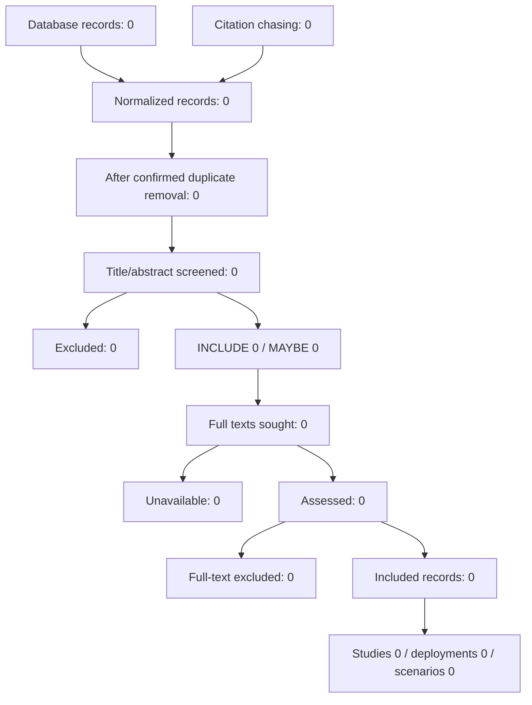

# PRISMA counts

Counts are computed from the files in this repository. Zero means the corresponding file has no coded rows. It is not a search result and it is not a completed review.

These counts were generated from repository data. They are not a completed review.

## Identification

- Records identified from databases: 0
- No database records are in the normalized table.
- Records identified from citation chasing: 0
- Records from other origins: 0
- Total records in the normalized table: 0
- Confirmed duplicate records removed: 0
- Candidate duplicate pairs still flagged: 0
- Records after confirmed duplicate removal: 0

## Title and abstract screening

- Records screened: 0
- INCLUDE: 0
- MAYBE: 0
- EXCLUDE: 0

## Full text

- Full texts sought: 0
- Full texts unavailable: 0
- Full texts assessed: 0
- Full-text availability unclear: 0
- Full-text availability still blank: 0
- INCLUDE: 0
- MAYBE: 0
- EXCLUDE: 0

## Included units

These four counts answer different questions. Do not substitute one for another.

- Included records (full-text INCLUDE): 0
- Publication rows linked to those records: 0
- Studies: 0
- Deployments: 0
- Scenarios: 0

## Flow

